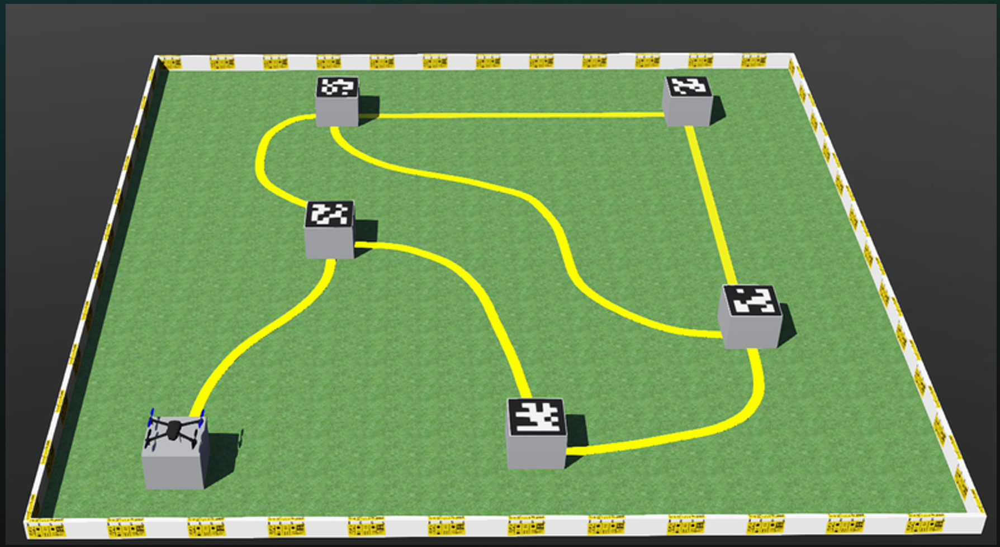
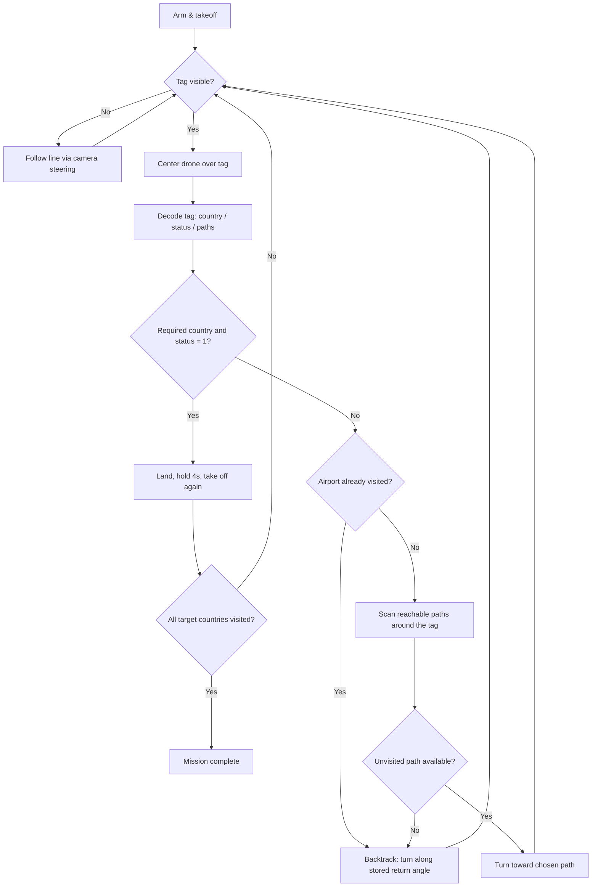

# Autonomous Drone Airport Navigation

 
**IESL RoboGames 2025/26 — University Category, Semi-Final Task**
**Team Motorbrains** · Semi-Finalists
 
A vision-guided drone that flies itself through a network of airports in a Webots/ArduPilot simulation, reading AprilTag markers to figure out where it is and running a graph search to find and land at every country it's asked to visit — no hardcoded tag IDs, no fixed paths.
 
---
 
## Overview
 
The drone operates entirely on live sensor data:
 
- **Line following** — an onboard downward/forward camera feed is thresholded into a binary mask of the guide line, which is fit to a curve to estimate steering direction in real time.
- **Airport identification** — each landing pad carries an AprilTag (family `36h11`) encoding a 3-digit ID. The drone detects and decodes it to learn the airport's country, landing status, and how many other airports connect to it.
- **Graph navigation** — starting with no map, the drone explores the airport network using a depth-first search with backtracking, until it has landed at an airport in every requested country.
Because tag placement is reshuffled between evaluation runs, the whole system has to work from scratch every time — nothing about airport identity or layout is assumed in advance.
 
---
 
## The Challenge
 
This task was set by IESL RoboGames as a simulated drone delivery problem:
 
- The drone must follow a yellow guide line (straight and curved sections) to travel between landing pads.
- Every landing pad is marked with an AprilTag that identifies the airport.
- The drone is given up to two target country codes and must land at one valid airport in each.
- After landing at a required airport, it must stay grounded for at least 4 seconds before taking off toward the next target.
- Flight height is capped at 3 m above the starting pad, and the whole run has a 4-minute simulation-time limit.
- Solutions are scored on completion time if the full task succeeds, or on a components basis (takeoff, line-following accuracy, airport-finding accuracy, landing accuracy) if it doesn't.
### Tag Encoding
 
Each AprilTag encodes a 3-digit number, one digit per field:
 
| Digit | Meaning | Example |
|---|---|---|
| 1st | Country code | `2` → belongs to country 2 |
| 2nd | Landing status | `1` = safe to land, `0` = unsafe |
| 3rd | Reachable airports | number of paths leading out from this airport |
 
For example, tag `211` decodes to: country `2`, landing status `1` (safe), `1` other airport reachable from here.
 
Target countries are set in `flight.py` via a fixed-name variable:
 
```python
Airports = [country1, country2]   # e.g. [1, 2]
Airports = [country1, 0]          # single destination
```
 
---
 
## How It Works
 

 
### Vision — `camera.py`
Connects to the onboard camera over TCP and does two independent jobs:
- **Line following** — samples three horizontal strips within a moving window around the last known line position, fits a low-order polynomial through them, and uses the curve's lookahead point and tangent direction to compute lateral error, path angle, and yaw rate.
- **AprilTag reading** — runs `apriltag` detection each frame; `get_tag_error()` gives the offset needed to center the drone over a tag, and `get_path_angles()` masks a ring around a detected tag to find where the guide line crosses it, classifying each crossing by the nearest tag side (top/right/bottom/left) so the mission logic knows which directions are available to explore.
### Flight Control — `control.py`
Wraps `pymavlink` to talk to ArduPilot SITL: connecting, arming, mode switching, takeoff/landing, sending body-frame velocity and yaw-rate setpoints, and issuing discrete yaw turns at path branches. `center_on_tag()` and `follow_path()` turn the vision outputs above into actual velocity commands.
 
### Mission Logic — `flight.py`
The top-level state machine:
1. Arm, take off, and either center on a visible tag or follow the line.
2. On reaching a tag, decode it and check whether it satisfies a still-outstanding target country.
3. If it does — land, wait, take off, and continue to the next target (or finish if none remain).
4. If not — treat it as a graph node: push the arrival direction onto a backtracking stack, scan for unexplored outbound paths, and turn toward one; if none remain, pop the stack and backtrack.
### `config.py`
Shared camera resolution constants (`IMG_WIDTH`, `IMG_HEIGHT`) used by both the vision and control modules.
 
---
 
## Interfaces
 
### Flight Controller — MAVLink
- Protocol: MAVLink v2 over the connection string configured in `flight.py` (`tcp:localhost:5763` by default — adjust to match your SITL instance)
- Coordinate frame: NED (North-East-Down)
- Used for: heartbeat/handshake, mode changes, arm/disarm, takeoff/land, and velocity + yaw setpoints
### Camera — TCP Stream
- Host/port: `127.0.0.1:5599` by default
- Each frame: a 4-byte header (`width`, `height` as little-endian unsigned shorts) followed by the raw pixel payload, read in row-major order
> **Note:** double-check that the pixel format your simulated camera actually sends (grayscale vs. RGB) matches how `camera.py` reshapes the incoming buffer — a mismatch here will silently misalign every frame after the first.
 
---
 
## Repository Structure
 
| Path | Contents |
|---|---|
| `flight.py` | Mission entry point — arms/flies the drone and runs the graph-search navigation logic |
| `control.py` | `DroneController` — MAVLink/pymavlink flight control wrapper |
| `camera.py` | `CameraStream` — line-following and AprilTag vision pipeline |
| `config.py` | Shared image dimension constants |
| `Task_Phase_1/` | Phase 1 milestone submission |
| `Task_Phase_2/` | Phase 2 / semi-final submission |
| `Simulation Video/` | Recorded demonstration run |
| `Makefile` | Build/run shortcuts — see file for exact targets |
 
---
 
## Getting Started
 
### Requirements
- [Webots](https://cyberbotics.com/) simulation environment
- ArduPilot SITL (ArduCopter)
- Python 3, with:
```bash
pip install numpy opencv-python apriltag pymavlink sympy
```
 
> On Windows/macOS, the `apriltag` package can be difficult to build from source — [`pupil-apriltags`](https://pypi.org/project/pupil-apriltags/) is a drop-in alternative if you hit install issues.
 
### Running
1. Open the provided Webots world file and start the simulation.
2. Launch ArduPilot SITL for the drone, matching the connection string used in `flight.py`.
3. Set your target countries in `flight.py`:
```python
   Airports = [1, 2]
```
4. Run the mission:
```bash
   python flight.py
```
 
See the `Makefile` for any project-specific shortcuts to the steps above.
 
---
 
## Notes & Future Improvements
- Verify the camera's actual pixel format (grayscale vs. RGB) against what `camera.py` expects.
- The graph search currently backtracks with a simple stack; a full visited-edge map could avoid a few redundant re-scans on dense airport networks.
- Steering and centering gains (`gain`, `lateral_gain`, `max_velocity` in `control.py`) are hand-tuned for the competition course and may need adjusting for other layouts.
---
 
## Result
 
**Semi-Finalists** — IESL RoboGames 2025/26, University Category, Advanced Robotics Programming Challenge.
 
## Team — Motorbrains
- [r-nimantha](https://github.com/r-nimantha)
- [Zee144](https://github.com/Zee144)
- [ManiiAya](https://github.com/ManiiAya) — Manitha Ayanaja
## Acknowledgements
IESL RoboGames 2025/26, organized with the Department of Computer Science & Engineering, University of Moratuwa, and sponsored by SLT-Mobitel.
